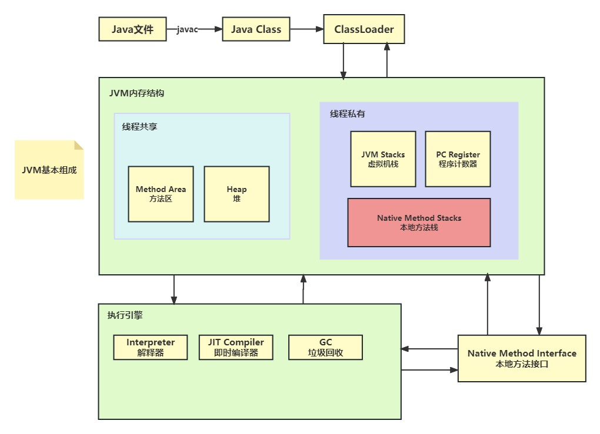
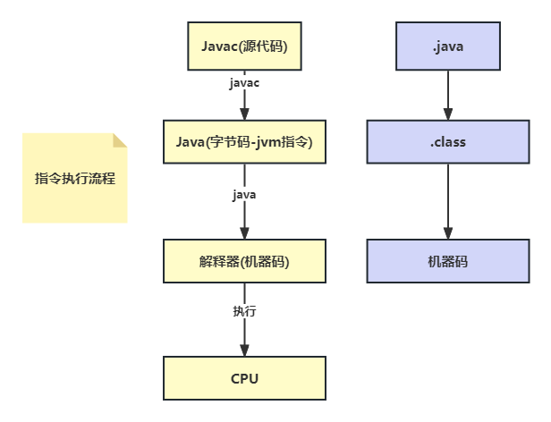
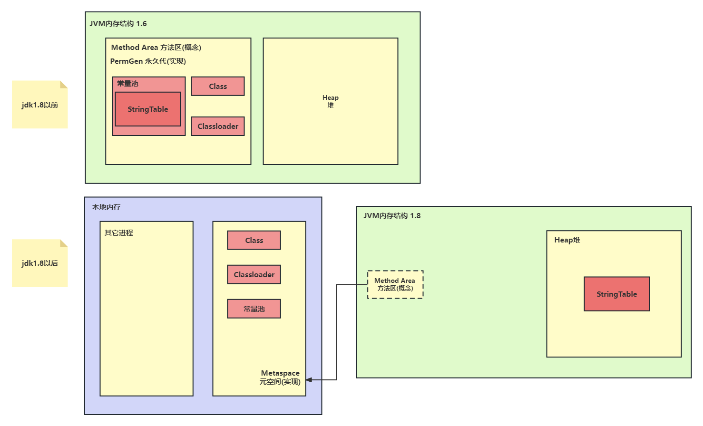

# 内存结构



## 一、程序计数器

### 1、定义
程序计数器（Program Counter）是JVM中的一块较小的内存区域，它是一个指向当前线程正在执行的字节码指令的指针。

- **程序计数器使用的是寄存器**，特点-快。
- 程序计数器作用是**记住下一条jvm执行的执行地址。**
  - 特点：
    1. 线程私有的
    2. 不会存在内存溢出-jvm规定了




### 2、作用
程序计数器在JVM中起着非常重要的作用：
- 保持线程间独立：每个线程都有自己的程序计数器，保证线程切换后能正确恢复到之前执行的位置。
- 控制线程执行：程序计数器通过不断更新指向下一条需要执行的字节码指令，控制线程的顺序执行。
- 异常处理：程序计数器在处理异常时提供线程恢复执行的信息。


## 二、虚拟机栈

### 1、定义
Java虚拟机栈（Java Virtual Machine Stack）是每个线程私有的，用于存储方法执行的内存区域。

- **虚拟机栈就是线程运行的内存空间**

作用：

- 管理方法的调用和返回：在方法调用时，会创建一个新的栈帧，用于保存方法的局部变量和中间结果，方法执行完成后，栈帧会被销毁，返回到上一次方法调用的位置。
- 线程私有的数据区：每个线程都有自己的Java虚拟机栈，保证了线程之间的数据隔离。
- 栈溢出检测：当栈的深度超过Java虚拟机栈所允许的最大深度，会抛出StackOverflowError异常，防止栈溢出。


### 2、栈帧

每个栈由多个栈帧(Frame)组成，对应着每次方法调用时所占用的内存：

- **每个方法在执行的同时都会创建一个栈帧，栈帧中包含了局部变量表、操作数栈、动态链接、方法出口等信息。**

- **栈帧：一次方法的调用，是每个方法运行时需要的内存**
  - 参数、局部变量、返回地址都需要存储

- 每个线程只能有一个活动栈帧，对应着当前正在执行的那个方法

> 栈帧的演示：

```java
public class StackFrameDemo {
    public static void main(String[] args) {
        int result = calculate(5, 3);
        System.out.println("Result: " + result);
    }
    public static int calculate(int a, int b) {
        return add(a, b);
    }
    public static int add(int a, int b) {
        return multiply(a, b);
    }
    public static int multiply(int a, int b) {
        return a * b;
    }
}
```


> 让我们分析代码的执行过程：

1. 在程序启动时，虚拟机会在虚拟机栈上创建一个栈帧，用于执行`main`方法。

2. 在`main`方法中，我们调用了`calculate`方法，并传递两个参数：`5`和`3`。

3. 进入`calculate`方法后，会创建一个新的栈帧，用于存储`calculate`方法执行时需要的局部变量和中间结果。此时，栈帧中会包含参数`a`和`b`，以及局部变量（无）。

4. 在`calculate`方法中，我们又调用了`add`方法，并传递之前的参数`a`和`b`。这时，会创建一个新的栈帧，将其压入虚拟机栈的栈顶。

5. 进入`add`方法后，同样会创建一个新的栈帧，用于存储`add`方法执行时需要的局部变量和中间结果。此时，栈帧中会包含参数`a`和`b`，以及局部变量（无）。

6. 在`add`方法中，我们又调用了`multiply`方法，并传递之前的参数`a`和`b`。这时，会创建一个新的栈帧，将其压入虚拟机栈的栈顶。

7. 进入`multiply`方法后，同样会创建一个新的栈帧，用于存储`multiply`方法执行时需要的局部变量和中间结果。此时，栈帧中会包含参数`a`和`b`，以及局部变量（无）。

8. 在`multiply`方法中，我们执行了`a * b`的操作，并得到结果。

9. 返回到`add`方法，将`multiply`方法的结果作为返回值。

10. 返回到`calculate`方法，将`add`方法的结果作为返回值。

11. 返回到`main`方法，将`calculate`方法的结果赋值给`result`变量。

12. 最后，输出`Result: 15`，程序运行结束。


### 3、栈问题辨析

> **垃圾回收是否涉及栈内存？**

​	垃圾回收不涉及栈内存中的数据，例如基本数据类型和对象的引用，都是在其作用域结束后自动释放，不需要垃圾回收。

- 垃圾回收主要针对堆内存中不再被引用的对象进行回收，以释放不再使用的内存。


> **栈内存分配越大越好吗？**

总体上来说，栈内存的大小由虚拟机根据硬件和系统配置预设，一般情况下不需要人为干预。过大的栈内存可能会浪费内存资源，并且会影响虚拟机的性能，因为虚拟机需要管理和维护更多的栈空间。

另一方面，如果应用程序确实需要较大的栈内存，例如处理递归深度较大的方法调用或者涉及到大量的局部变量，可以通过虚拟机参数进行调整。但是，需要谨慎调整栈内存大小，避免设置过大，导致系统内存资源过度占用，从而影响其他部分的应用程序性能。

此外，栈内存的分配也会影响线程数量，因为系统内存资源是有限的。过大的栈内存可能导致可以创建的线程数量减少，从而影响并发能力。因此，在设置栈内存大小时，还应该考虑应用程序的并发需求。

综上所述，栈内存分配的大小应该根据应用程序的具体需求和系统资源进行适当的调整，不宜盲目设置过大或过小。默认的栈内存分配通常能够满足大多数应用程序的需求。


> **方法内的局部变量是否线程安全？**

方法内的局部变量是否线程安全，取决于其作用域和是否逃离方法的范围。

1. **如果方法内局部变量没有逃离方法的作用范围，即局部变量仅在方法内部使用且不被其他线程访问，那么它是线程安全的。**每个线程在执行方法时，都会有自己独立的栈帧和局部变量，彼此之间不会相互干扰，因此局部变量的数据是线程私有的。

2. **如果局部变量引用了对象，并逃离方法的作用范围，例如作为方法的返回值、传递给其他方法或存储在全局变量中，就需要考虑线程安全性了**。如果多个线程同时访问这个逃离方法作用范围的对象，可能会引发并发问题，例如竞态条件（Race Condition）、数据不一致等。在这种情况下，需要采取措施来保证线程安全，比如使用同步机制（如锁）来保护共享资源，或者使用线程安全的数据结构。

总结来说，方法内的局部变量通常是线程安全的，因为每个线程都有自己的栈帧和局部变量，互相之间不会干扰。但是，如果局部变量引用的对象逃离了方法的作用范围，就需要注意线程安全性，确保在并发环境下正确地处理共享资源。


### 4、栈内存溢出

栈内存溢出（StackOverflow）是指虚拟机栈的深度超过了Java虚拟机栈所允许的最大深度，导致栈空间不足，无法继续创建新的栈帧。通常情况下，栈内存溢出是由于递归调用层级过深或者方法调用链太长导致的。

- 栈帧过多导致内存溢出
- 栈帧过大导致内存溢出

当一个方法被调用时，会在虚拟机栈上创建一个栈帧，用于保存方法的局部变量和中间结果。每个栈帧的大小是固定的，虚拟机栈的深度是有限的，当栈的深度超过了栈的容量，就会抛出**StackOverflowError异常**，导致程序终止。

> 让我们来看一个简单的示例，演示栈内存溢出的情况：

```java
public class StackOverflowExample {
    public static void main(String[] args) {
        recursiveMethod();
    }

    public static void recursiveMethod() {
        recursiveMethod(); // 递归调用自身
    }
}
```

在上述代码中，我们定义了一个递归方法`recursiveMethod`，在方法内部不断地调用自身，形成了无限递归。由于递归没有结束条件，栈内存会不断地创建新的栈帧，直到超出栈的容量，导致栈内存溢出。

当我们运行这段代码时，会抛出`StackOverflowError`异常，提示栈内存溢出，从而终止程序的运行。

为了避免栈内存溢出，应该确保递归调用有明确的结束条件，或者减少方法调用链的层级，以保证栈的深度不会超过栈的容量。


> 其它实例：

在Lombok中，`@Data`注解会自动为类生成`equals()`和`hashCode()`方法，这些方法用于对象的比较和哈希码计算。在某些情况下，使用`@Data`注解可能会引发循环调用的问题，特别是在涉及相互引用的类之间。

考虑以下示例：

```java
import lombok.Data;

@Data
public class Person {
    private String name;
    private int age;
    private Address address;
}

@Data
public class Address {
    private String city;
    private String street;
    private Person person;
}
```

在上述代码中，`Person`类和`Address`类之间存在相互引用，即`Person`对象中包含一个`Address`对象，而`Address`对象中又包含一个`Person`对象。

当使用`@Data`注解生成`equals()`和`hashCode()`方法后，由于存在相互引用，`hashCode()`方法可能会陷入循环调用的情况。这是因为在计算哈希码时，`Person`对象会调用`Address`对象的`hashCode()`方法，而在计算`Address`对象的哈希码时，又会调用`Person`对象的`hashCode()`方法，从而形成了循环调用。

为了避免这种问题，可以采取以下解决方案之一：

1. **手动实现`hashCode()`方法：** 不使用Lombok生成的`hashCode()`方法，而是手动实现`hashCode()`方法，确保避免循环调用的情况。在手动实现`hashCode()`方法时，需要注意避免使用相互引用的属性来计算哈希码。

```java
import lombok.Data;

@Data
public class Person {
    private String name;
    private int age;
    private Address address;

    @Override
    public int hashCode() {
        // 根据需要计算哈希码，避免使用相互引用的属性
        // ...
    }
}
```

2. **使用`@EqualsAndHashCode(exclude = "address")`：** 使用`@EqualsAndHashCode`注解，通过`exclude`属性排除相互引用的属性，从而避免循环调用。

```java
import lombok.Data;
import lombok.EqualsAndHashCode;

@Data
@EqualsAndHashCode(exclude = "address")
public class Person {
    private String name;
    private int age;
    private Address address;
}
```

通过上述方式，可以解决Lombok生成的`hashCode()`方法引发循环调用的问题。选择哪种方式取决于业务需求和代码结构。


### 5、线程运行诊断

#### 5.1 CPU占用过高

定位高CPU占用问题通常需要进行以下步骤：

1. 使用`top`命令查看当前系统中CPU占用最高的**进程**：
   ```
   top
   ```
   在top命令输出中，可以查看CPU占用最高的进程和对应的进程ID（PID）。

2. 使用`ps`命令进一步查找导致高CPU占用的**线程**：
   ```
   ps -H -eo pid,tid,pcpu | grep <进程ID>
   ```
   上述命令可以列出指定进程ID下的所有线程及其CPU占用情况。

3. 使用`jstack`命令获取高CPU占用线程的**堆栈信息**：
   ```
   jstack <进程ID(16进制)>
   ```
   通过jstack命令获取线程的堆栈信息，可以查看线程的状态和执行轨迹，帮助定位导致高CPU占用的**代码段**。

4. 分析堆栈信息，定位问题代码：
   根据jstack输出的堆栈信息，定位到导致高CPU占用的代码段，特别关注可能导致死循环、长时间计算等问题。

5. 修复问题代码并进行性能优化：
   一旦定位了导致高CPU占用的问题代码，进行必要的修复和优化，确保代码逻辑正确、高效。


#### 5.2 程序运行很长时间没有结果

如果程序运行时间过长没有结果，可能有多种原因导致。首先，可以考虑以下几点来进行定位：

1. 确认程序是否真的在运行：
   使用类似`top`或`ps`命令查看程序是否在运行，确保程序没有被挂起或僵死。

2. 检查程序是否进入了死循环或长时间的等待状态：
   通过查看程序的日志或输出，确认程序是否在某个地方出现了死循环、阻塞等问题。

3. 检查程序是否存在资源竞争或死锁：
   使用线程运行诊断工具（如jstack）来查看线程的堆栈信息，特别关注是否存在死锁或资源竞争问题。

4. 检查程序是否在处理大量数据或复杂计算：
   如果程序涉及大量数据处理或复杂计算，可能需要更长的运行时间。但也要确保程序没有出现性能瓶颈。

5. 检查是否有意外的异常或错误导致程序中断：
   查看程序的日志或输出，确认是否有未处理的异常或错误导致程序提前中断。

6. 进行性能优化或并发优化：
   如果程序处理的数据量较大或涉及复杂计算，可以考虑进行性能优化或并发优化，以提高程序的执行效率。

根据具体情况，对程序进行细致的调查和分析，可以帮助找出问题所在，并采取相应的措施解决。


## 三、本地方法栈

### 1、定义
本地方法栈（Native Method Stack）与Java虚拟机栈类似，但它为执行本地方法（Native方法）服务。本地方法是使用其他语言（如C、C++）编写的，通过JNI（Java Native Interface）与Java程序交互。


> Obejct类中的本地方法：

```java
public class Object {

    private static native void registerNatives();
    static {
        registerNatives();
    }

    public final native Class<?> getClass();

    public native int hashCode();

    protected native Object clone() throws CloneNotSupportedException;

    public final native void notify();

    public final native void notifyAll();

    public final native void wait(long timeout) throws InterruptedException;

}
```


### 2、作用
本地方法栈的作用是：
- 管理本地方法的调用和返回：与Java虚拟机栈类似，本地方法栈也用于保存本地方法的调用信息。
- 提供本地方法调用的支持：通过本地方法栈，Java程序可以调用本地方法并与其他语言交互，扩展了Java的功能。


## 四、堆

### 1、定义
Java堆（Java Heap）是JVM中最大的一块内存区域，用于存储Java对象的实例和数组。所有线程共享Java堆，在JVM启动时创建。

- 所有通过`new`关键字创建的对象都在Java堆中分配内存

特点：

- 它是线程共享的，堆中对象都**需要考虑线程安全的问题**
- **有垃圾回收机制**


### 2、堆内存溢出

堆内存溢出（Heap Overflow）是指Java堆中的内存使用超过了堆的容量限制，导致无法再为新的对象分配内存，从而抛出`OutOfMemoryError`异常。

堆内存溢出通常是由于以下原因之一引起的：

1. **对象数量过多：** 当Java应用程序创建了大量的对象，并且这些对象长时间无法被垃圾回收器回收时，堆内存可能会被耗尽。

2. **对象大小过大：** 单个对象占用的内存过大，导致堆内存不足以容纳更多的对象。

3. **内存泄漏：** 程序中存在内存泄漏问题，导致对象长时间无法被释放，从而占用了堆内存。

堆内存溢出是常见的Java内存溢出情况之一，特别是在应用程序处理大量数据或者复杂数据结构时容易发生。为了避免堆内存溢出，可以采取以下措施：

- 优化对象的创建和销毁：避免创建过多的临时对象，及时释放不再使用的对象，以便让垃圾回收器回收。

- 增加堆内存大小：可以通过虚拟机参数调整堆内存大小，以便为应用程序提供更多的内存空间。

- 检查内存泄漏：定期检查应用程序是否存在内存泄漏问题，及时修复问题代码。

在Java中，可以使用以下虚拟机参数来调整堆内存的大小：

- `-Xms`: 设置堆的初始大小（初始内存）
- `-Xmx`: 设置堆的最大大小（最大内存）

例如，可以通过以下方式将堆的初始大小设置为256MB，最大大小设置为1GB：

```
java -Xms256m -Xmx1g YourMainClass
```

请注意，调整堆内存大小需要根据应用程序的需求和可用的物理内存进行权衡，不宜设置过小或过大。过小的堆内存可能导致频繁的垃圾回收和性能问题，过大的堆内存可能导致占用过多的物理内存，影响系统的稳定性和其他应用程序的运行。


### 3、堆内存诊断

在Java中，我们可以使用一些工具来诊断堆内存的使用情况和性能问题。以下是一些常用的堆内存诊断工具：

1. **jps工具（Java Virtual Machine Process Status Tool）：** 用于查看当前系统中**有哪些Java进程在运行**。它可以列出Java进程的进程ID（PID）以及主类的名称。

   使用命令：`jps`

2. **jmap工具（Java Memory Map）：** 用于查看**Java进程的堆内存占用情况**。它可以输出Java堆内存的详细信息，包括堆内存使用的统计信息、堆中对象的数量和大小、GC信息等。

   使用命令：`jmap -heap <pid>`

   其中，`<pid>`是Java进程的进程ID。通过jps命令可以获取Java进程的进程ID。

3. **jconsole工具（Java Monitoring and Management Console）：** 是一个图形界面的多功能监测工具，可以连续监测Java应用程序的性能数据，包括堆内存、线程、垃圾回收等信息。

   使用方式：可以通过命令行启动jconsole工具，然后选择要监测的Java进程进行连接。也可以在JVisualVM中直接启动jconsole。

   注意：JVisualVM是JDK自带的可视化多功能监测工具，除了支持jconsole功能外，还提供了更多功能，如线程分析、内存分析、垃圾回收分析等。

使用这些工具可以帮助开发人员进行堆内存使用情况的分析和性能调优，以及发现可能存在的内存泄漏或者其他性能问题。在定位问题时，可以先使用jps工具查看当前系统中的Java进程，然后通过jmap工具查看特定进程的堆内存情况，最后使用jconsole或者JVisualVM来进行图形化的监测和分析。


## 五、方法区

### 1、定义

**方法区（Method Area）是Java虚拟机的一块内存区域，用于存储类的结构信息，包括类的字段、方法、常量池等。它是所有线程共享的内存区域，在JVM启动时创建。**

方法区主要用于存储以下信息：

1. 类的信息：包括类的名称、父类的名称、类的修饰符（public、final等）、字段描述符、方法描述符等。

2. 字段信息：存储类中声明的所有字段的名称、类型、访问权限等信息。

3. 方法信息：存储类中声明的所有方法的名称、参数类型、返回值类型、访问权限等信息。

4. 运行时常量池：用于存储编译期生成的各种字面量和符号引用。

5. 类的静态变量：存储类的静态字段，包括静态基本类型和静态引用类型。

6. 类的字节码：存储类的字节码指令，用于执行类的方法。

方法区和堆一样，也是被所有线程共享的，因此它需要考虑线程安全的问题。在方法区中，存储的类信息和运行时常量池是非常重要的部分，它们对于类的加载、链接和运行都起着重要的作用。

- 在HotSpot虚拟机中，方法区的实现通常是永久代（Permanent Generation）
  - 在Java 8 及之前的版本中，方法区是位于Java**堆内存中的一部分**，用于存储类的信息、常量池、静态变量、即时编译器编译后的代码等。

- 在JDK 8之后，永久代被元数据区（Metaspace）所取代
  - 元空间不再是Java堆的一部分，而是位于**本地内存**中。
  - 元空间的管理是由操作系统进行的，它不再像方法区那样受到Java堆大小的限制，因此可以更灵活地分配内存，有效地避免了一些方法区出现的内存溢出问题。



需要注意的是，方法区的大小是有限制的，如果类的结构信息过多，或者运行时常量池占用过多内存，都有可能导致方法区的内存溢出。在遇到方法区内存溢出问题时，通常可以通过增大方法区的内存或者优化类加载、卸载等操作来解决。


### 2、方法区内存溢出

方法区内存溢出在Java 8之前和Java 8及之后有不同的表现：

##### 1. Java 8之前 - 永久代内存溢出（PermGen OutOfMemory）

在Java 8之前，方法区被称为永久代（Permanent Generation），用于存储类的信息、常量池、静态变量等。如果加载的类过多或者有大量的动态生成类，就可能导致永久代内存溢出。

示例代码：

```java
import java.util.ArrayList;
import java.util.List;

public class PermGenOutOfMemory {
    public static void main(String[] args) {
        List<Class<?>> list = new ArrayList<>();
        int i = 0;
        while (true) {
            try {
                ClassLoader classLoader = new CustomClassLoader();
                String className = "Class" + i++;
                byte[] byteCode = generateClassByteCode(className);
                Class<?> clazz = classLoader.defineClass(className, byteCode, 0, byteCode.length);
                list.add(clazz);
            } catch (Throwable e) {
                e.printStackTrace();
            }
        }
    }

    private static byte[] generateClassByteCode(String className) {
        // Generate and return class bytecode dynamically
        // ...
    }

    static class CustomClassLoader extends ClassLoader {
        // Custom class loader to define classes
    }
}
```

在上述示例中，我们通过自定义类加载器动态生成类，并将其加载到永久代中，从而导致永久代内存溢出。为了模拟内存溢出，我们使用了一个无限循环，不断地加载类。

为了执行该示例，我们需要设置永久代的最大大小（MaxPermSize）。可以使用以下JVM参数：

```
-XX:MaxPermSize=8m
```

永久代内存溢出会导致`java.lang.OutOfMemoryError: PermGen space`异常。


##### 2. Java 8及之后 - 元空间内存溢出（Metaspace OutOfMemory）

在Java 8及之后的版本中，永久代被移除，取而代之的是元空间（Metaspace）。元空间是在本地内存中实现的，它不再受限于固定大小，可以根据需要动态分配内存。

但是，元空间仍然有一个上限，默认情况下它会根据系统的物理内存动态调整大小。当加载的类数量过多或者动态生成的类过多时，元空间的大小可能会增长，并且如果超过了元空间的最大大小，就会导致元空间内存溢出。

示例代码：

```java
import java.util.ArrayList;
import java.util.List;

public class MetaspaceOutOfMemory {
    public static void main(String[] args) {
        List<Class<?>> list = new ArrayList<>();
        int i = 0;
        while (true) {
            try {
                ClassLoader classLoader = new CustomClassLoader();
                String className = "Class" + i++;
                byte[] byteCode = generateClassByteCode(className);
                Class<?> clazz = classLoader.defineClass(className, byteCode, 0, byteCode.length);
                list.add(clazz);
            } catch (Throwable e) {
                e.printStackTrace();
            }
        }
    }

    private static byte[] generateClassByteCode(String className) {
        // Generate and return class bytecode dynamically
        // ...
    }

    static class CustomClassLoader extends ClassLoader {
        // Custom class loader to define classes
    }
}
```

在上述示例中，我们使用了与永久代内存溢出示例相同的代码。为了执行该示例，我们需要设置元空间的最大大小（MaxMetaspaceSize）。可以使用以下JVM参数：

```
-XX:MaxMetaspaceSize=8m
```

请注意，在Java 8及之后的版本中，我们使用的是元空间的内存参数，而不再使用永久代的内存参数。元空间内存溢出会导致`java.lang.OutOfMemoryError: Metaspace`异常。


## 六、常量池

### 1、定义

常量池是Java虚拟机（JVM）中的一块内存区域，用于**存储在编译期间生成的字面量和符号引用**。在Java程序中，我们使用常量来表示不变的数据，比如字符串、整数等。常量池在Java中起到了存储常量数据和共享常量数据的作用，它包含了许多常量的符号引用，使得Java程序在运行时可以通过符号引用快速定位到对应的常量值。

常量池可以分为两个部分：

1. **编译期常量池**：也称为静态常量池，它是在编译阶段由编译器生成并存储在字节码文件中的。编译期常量池包含了类中的常量数据和对其他类、方法、字段的符号引用，它是每个类的私有常量池，与类一一对应。

2. **运行时常量池**：也称为动态常量池，它是在类加载后由JVM在内存中动态生成的。运行时常量池包含了编译期常量池的全部信息，并且可以存储一些在类加载时才能确定的常量数据，比如**通过反射生成的类、方法等。每个类的运行时常量池都是在方法区中分配的，也就是堆内存的一部分**。

运行时常量池相对于编译期常量池来说，具有更大的灵活性和动态性。在运行时，JVM可以动态地修改运行时常量池的内容，比如通过类加载器动态生成新的类或者动态添加常量数据。而编译期常量池是在编译时确定的，一旦生成了字节码文件，就不会再改变。

总结：
- 编译期常量池是在编译阶段由编译器生成的，存储在字节码文件中，每个类都有一个私有的编译期常量池。
- 运行时常量池是在类加载后由JVM动态生成的，包含了编译期常量池的全部信息，每个类的运行时常量池在方法区中分配。
- 运行时常量池具有更大的灵活性和动态性，可以在运行时动态添加常量数据，而编译期常量池是在编译时确定的。


### 2、StringTable(串池)

1.8在堆、1.6在永久代

> 常见面试题1：

```java
String s1 = "a";
String s2 = "b";
String s3 = "a" + "b";
String s4 = s1 + s2;
String s5 = "ab";
String s6 = s4.intern();
System.out.println(s3 == s4); // 输出false
System.out.println(s3 == s5); // 输出true
System.out.println(s3 == s6); // 输出true

String s = new String("c") + new String("d");
String x = "cd";
String s2 = s.intern();

System.out.println(x == s);  // 输出false
System.out.println(s == s2); // 输出true
//如果是jdk1.6呢()
System.out.println(s == s2); // 输出false
```

- 字符串常量相加，在编译阶段，如果发现字符串相加的操作都是字面量常量，则会进行编译期优化，直接在编译阶段将其连接成一个字符串，实际创建一个对象

- 字符串变量相加，jvm会创建new StringBuilder，使用append()方法添加两个变量，然后toString()转换为字符串常量，返回

  1. `new StringBuilder()`，在堆创建对象
  2. `append()`方法追加两个变量，`toString()`转换为字符串常量，将字符串常量存储到常量池，返回常量池引用
  3. 返回堆空间引用

- `intern()`方法【入池操作】在JDK 1.6和JDK 1.8中有一些细微的区别。以下是它们的具体行为：

  > JDK 1.6 中的 `intern()`

  在JDK 1.6中，`intern()`方法的行为较为复杂。它会首先检查字符串常量池中是否存在当前字符串对象的引用。如果常量池中不存在相同内容的字符串，则将当前字符串对象复制一份，存放到常量池中，并返回常量池中新字符串的引用。这意味着每次调用`intern()`方法都会复制一份字符串到常量池，如果频繁调用会导致常量池膨胀，增加内存占用。

  示例：

  ```java
  String s1 = new String("hello");
  String s2 = "hello";
  String s3 = s1.intern();
  
  System.out.println(s1 == s2); // false
  System.out.println(s2 == s3); // true
  ```

  在JDK 1.6中，`s1.intern()`会将`s1`的副本放入常量池，而`"hello"`字符串字面量在常量池中会复制一份。因此，`s2`和`s3`指向的是同一个常量池中的字符串对象，所以`s2 == s3`返回`true`。

  > JDK 1.8 中的 `intern()`

  在JDK 1.8中，`intern()`方法的行为发生了较大改变。它不再复制实例到常量池，而是将实例的引用直接存储到常量池中。如果常量池中已经存在相同内容的字符串，就返回常量池中的字符串引用；否则，就将当前字符串对象的引用存储到常量池，并返回该引用。这样做的好处是减少了字符串复制的开销，节省了内存。

  示例：

  ```java
  String s1 = new String("hello");
  String s2 = "hello";
  String s3 = s1.intern();
  
  System.out.println(s1 == s2); // false
  System.out.println(s2 == s3); // true
  ```

  在JDK 1.8中，`s1.intern()`会直接将`s2`指向的字符串对象的引用存储到常量池，而不会复制任何内容。所以，`s2 == s3`返回`true`，因为它们都指向了常量池中的同一个字符串对象。

  总结：JDK 1.6中的`intern()`方法会复制实例到常量池，而JDK 1.8中的`intern()`方法只是将实例的引用存储到常量池中，不会复制内容。因此，在JDK 1.8中，频繁调用`intern()`方法不会导致常量池膨胀，而在JDK 1.6中则可能会增加内存占用。


### 3、调优

在Java中，`String`对象是不可变的，它们存储在一个被称为"stringtable"的全局字符串池中。字符串池的主要目的是节省内存，因为许多字符串在应用程序中可能会被重复使用。在进行stringtable的系统调优时，我们主要关注的是如何合理地管理字符串池，以及如何避免不必要的内存占用。

下面是一些关于stringtable的系统调优技巧：

1. **避免不必要的字符串创建：** 由于String是不可变的，每次对字符串进行修改（例如拼接、替换等）都会创建新的String对象。在频繁的字符串拼接场景中，推荐使用`StringBuilder`或`StringBuffer`类，它们可变且效率更高。

2. **小字符串的intern处理：** 小字符串（长度较短）在stringtable中占用的内存通常较少。对于这类字符串，可以使用`intern()`方法将其加入字符串池，这样可以节省内存，但要注意不要滥用，以免导致过多的字符串进入池中，此外`intern()`也可以进行去除重复的字符串对象，。

3. **适当配置StringTable大小：** stringtable的大小可以通过JVM参数进行配置。在JDK 8及以上版本，可以使用参数`-XX:StringTableSize=`来设置StringTable的大小。增大StringTable大小可能会导致更多的内存消耗，但也可以降低哈希冲突，提高性能。

4. **合理设置字符串池GC策略：** 从JDK 7开始，字符串池被移到堆内存中，意味着它受到垃圾回收的影响。可以根据应用程序的特性和内存需求，适当调整GC策略，避免因过度GC导致性能下降。

5. **避免过多长期存活的字符串：** 由于字符串池的字符串在整个应用程序生命周期中一直存在，长期存活的大字符串可能导致内存占用过高。对于这类长期存活的大字符串，可以考虑使用`WeakHashMap`等数据结构，以便在合适的时机进行垃圾回收。

6. **及时释放不再使用的字符串：** 当字符串不再需要时，尽量将其设置为null，以便垃圾回收器能够及时回收这些不再使用的字符串对象。

总的来说，stringtable是一个Java虚拟机内存管理的重要组成部分，对于内存敏感的应用程序来说，合理地管理和调优stringtable是非常重要的。需要根据具体的应用场景和性能需求来选择合适的调优策略。同时，建议使用较新版本的JDK，因为Java平台在更新的版本中通常会对性能和内存管理进行优化。


## 七、直接内存(系统内存)

### 1、定义

直接内存（Direct Memory）是**JVM中一种特殊的内存区域，它不是Java虚拟机运行时数据区域的一部分，而是JVM直接使用系统内存**。直接内存的使用不受Java堆大小限制，可以更加灵活地管理大量的数据，同时也能减少Java堆和垃圾回收的压力。

在Java中，直接内存通常是通过`java.nio`包中的`ByteBuffer`类来实现。`ByteBuffer`类提供了一种在堆外分配内存的方式，将数据存储在直接内存中。直接内存的分配和释放不会触发Java堆的垃圾回收，因此在处理大量数据或需要频繁的I/O操作时，使用直接内存可以提高性能。

直接内存的优势：
1. **零拷贝：** 直接内存的数据可以在Java堆和直接内存之间进行零拷贝，提高了数据传输的效率。
2. **不受GC影响：** 直接内存的分配和释放不会导致Java堆的垃圾回收，减少了垃圾回收的压力。
3. **更大的数据处理能力：** 直接内存可以利用系统的物理内存，可以处理更大的数据集。

然而，直接内存也有一些注意事项：
1. **内存泄漏风险：** 直接内存的释放不受Java堆垃圾回收的控制，如果不正确地管理直接内存，可能会导致内存泄漏问题。
2. **相对复杂：** 相比Java堆内存，直接内存的使用较为复杂，需要手动管理内存。

要使用直接内存，你可以通过`ByteBuffer`类的静态方法`allocateDirect()`来分配直接内存。同时，为了保证正确地释放直接内存，你需要手动调用`ByteBuffer`的`clear()`方法来释放内存。

```java
import java.nio.ByteBuffer;

public class DirectMemoryExample {
    public static void main(String[] args) {
        int bufferSize = 1024 * 1024; // 1 MB
        ByteBuffer directBuffer = ByteBuffer.allocateDirect(bufferSize);
        
        // 使用直接内存进行数据处理，例如读写文件，网络传输等
        
        // 释放直接内存
        directBuffer.clear();
    }
}
```

总之，直接内存是JVM中的一种高效的内存管理方式，适用于处理大量数据或需要频繁的I/O操作的场景。但是，要注意正确地管理直接内存，避免内存泄漏等问题。

此外还可以通过Unsafe来进行分配和释放：

- 分配：unsafe.allocateMemory(int size)
- 释放：unsafe.freeMemory(long size)


### 2、分配和释放

对于直接内存的分配和回收，你提到了两种方式：使用`Unsafe`对象完成直接内存的分配回收，以及`ByteBuffer`类内部使用`Cleaner`来监测并释放直接内存。

1. 使用`Unsafe`对象完成直接内存的分配和回收：
Java中的`Unsafe`类提供了一种在Java堆之外直接分配和释放内存的能力。通过`Unsafe`类可以使用`allocateMemory()`方法来分配直接内存，以及使用`freeMemory()`方法来释放直接内存。这种方式需要手动管理内存，因此在使用时需要非常谨慎，避免内存泄漏等问题。

2. `ByteBuffer`类内部使用`Cleaner`来监测并释放直接内存：
Java中的`ByteBuffer`类使用了`Cleaner`对象来监测其所管理的直接内存。`Cleaner`是一个虚引用，它会在垃圾回收器准备回收`ByteBuffer`对象时被放入引用队列。一旦`ByteBuffer`对象被垃圾回收，`Cleaner`对象将被`ReferenceHandler`线程处理，并通过`Cleaner`的`clean()`方法来释放直接内存。

这种方式相比直接使用`Unsafe`来管理直接内存，更加安全和方便。`ByteBuffer`类封装了直接内存的分配和释放过程，开发者无需手动管理内存，只需要正确地使用`ByteBuffer`对象即可。一旦`ByteBuffer`对象不再被引用，垃圾回收器会自动处理并释放相关的直接内存。

总的来说，直接内存的分配和回收可以通过`Unsafe`类进行手动管理，或者通过`ByteBuffer`类自动管理（利用`Cleaner`机制）。自动管理直接内存的方式更为推荐，因为它可以减少手动管理带来的错误和安全隐患。


